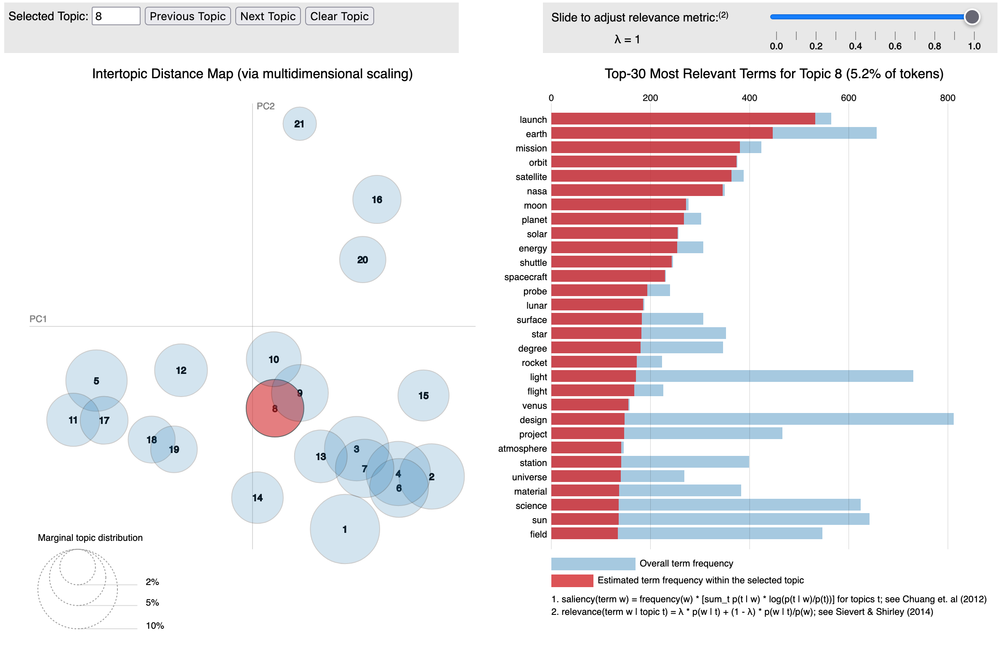

Topic Models: A tool for uncovering hidden themes in data
================
Mohit Yadav \| Quant UX Conference 2023

-   <a href="#1-loading-dataset" id="toc-1-loading-dataset">1 Loading
    dataset</a>
-   <a href="#2-pre-processing" id="toc-2-pre-processing">2
    Pre-processing</a>
    -   <a href="#21-pre-processing-training-data"
        id="toc-21-pre-processing-training-data">2.1 Pre-processing training
        data</a>
    -   <a href="#22-pre-processing-held-out-data"
        id="toc-22-pre-processing-held-out-data">2.2 Pre-processing held out
        data</a>
    -   <a href="#23-converting-dfm-to-topicmodels-format"
        id="toc-23-converting-dfm-to-topicmodels-format">2.3 Converting dfm to
        topicmodels format</a>
-   <a href="#3-modelling" id="toc-3-modelling">3 Modelling</a>
-   <a href="#4-model-evaluation" id="toc-4-model-evaluation">4 Model
    Evaluation</a>
    -   <a href="#41-human-evaluation" id="toc-41-human-evaluation">4.1 Human
        Evaluation</a>
        -   <a href="#411-word-intrusion" id="toc-411-word-intrusion">4.1.1 Word
            Intrusion</a>
        -   <a href="#412-topic-intrusion" id="toc-412-topic-intrusion">4.1.2 Topic
            Intrusion</a>
    -   <a href="#42-automated-evaluation" id="toc-42-automated-evaluation">4.2
        Automated Evaluation</a>
        -   <a href="#421-perplexity" id="toc-421-perplexity">4.2.1 Perplexity</a>
        -   <a href="#422-coherence" id="toc-422-coherence">4.2.2 Coherence</a>
-   <a href="#5-model-visualisation" id="toc-5-model-visualisation">5 Model
    Visualisation</a>
-   <a href="#6-document-similarity" id="toc-6-document-similarity">6
    Document similarity</a>

# 1 Loading dataset

Loading **20 newsgroup dataset** [via scikit](./Modules/dataLoader.py)

The dataset has been [pre-processed](./Modules/lemmatiser.py) as
following:

-   Removed stopwords
-   Lemmatised
-   Removed docs with less than 20 to and more than 10000 tokens

``` r
df <- read.csv('./Data/lemmatised_text.csv')
dim(df)
```

    ## [1] 16126     1

Splitting dataset into **train and held out(test)** sets for
[perplexity](#%20Perplexity) evaluation measure.

``` r
train_doc_n = 0.85 * dim(df)[1] #85-15 split into train and test
train_data <- df[0:(round(train_doc_n)-1),] 
test_data <- df[round(train_doc_n):dim(df)[1],]
temp_dat <- df[0:1000,]
```

# 2 Pre-processing

**Tokenising via quanteda**

-   Removing punctuations
-   Removing numbers
-   Removing words with less than 3 characters
-   Removing stopwords
-   Removing regex pattern of dashes (–+)
-   Identifying frequent multiword tokens (colloacation)
-   Creating single token from multiword tokens

**Pre-processing Document Feature Matrix**

-   Converting documents to Document Feature Matrix (dfm_matrix)
-   Removing uncommon terms (less than 25 document occurences)
-   Removing common terms (more than 7% document occurences)
-   Removing docs and rows that have 0 tokens after pre-processing

## 2.1 Pre-processing training data

``` r
# Tokenising
source('./Modules/R/rTokenising.r')
toks <- preProcess(train_data)
```

``` r
# Converting documents to Document Feature Matrix (dfm_matrix)
dfm_matrix <- dfm(toks)
dim(dfm_matrix)
```

    ## [1]  13706 106265

``` r
# Removing uncommon terms (less than 25 document occurences)
# Removing common terms (more than 7% document occurences)
dfm_matrix <- dfm_trim(dfm_matrix, min_termfreq = 25, max_termfreq = round(length(train_data) * 0.07))
dim(dfm_matrix)
```

    ## [1] 13706  5679

``` r
# Removing docs and rows that have 0 tokens after pre-processing
source('./Modules/R/zeroRows.r')

ZeroRowDfm <- dfm_matrix[rowSums(dfm_matrix) == 0,]
dim(ZeroRowDfm)
```

    ## [1]    8 5679

``` r
# DFM with removal of rows with 0 terms after preprocessing.
dfm_matrix <- dfm_matrix[rowSums(dfm_matrix) != 0,]
dim(dfm_matrix)
```

    ## [1] 13698  5679

``` r
# Dataset with removal of docs with 0 terms after preprocessing.
zeroIndex <- zeroRowIndex(ZeroRowDfm)
train_data_processed <- train_data[-c(zeroIndex)]
```

## 2.2 Pre-processing held out data

Repeating the above **[pre-processing steps](#%20Pre-processing)** for
testing data.

``` r
# Tokenising
toks_test <- preProcess(test_data)

# Converting documents to Document Feature Matrix (dfm_matrix)
dfm_matrix_test <- dfm(toks_test)
dim(dfm_matrix_test)
```

    ## [1]  2420 30489

``` r
# Removing uncommon terms (less than 15 document occurences)
# Removing common terms (more than 7% document occurences)
dfm_matrix_test <- dfm_trim(dfm_matrix_test, min_termfreq = 15, max_termfreq = round(length(temp_dat) * 0.07))
dim(dfm_matrix_test)
```

    ## [1] 2420 1810

``` r
# Removing docs and rows that have 0 tokens after pre-processing
ZeroRowDfm_test <- dfm_matrix_test[rowSums(dfm_matrix_test) == 0,]

# DFM with removal of rows with 0 rows after preprocessing.
dfm_matrix_test <- dfm_matrix_test[rowSums(dfm_matrix_test) != 0,]
dim(dfm_matrix_test)
```

    ## [1] 2405 1810

``` r
# Dataset with removal of docs with 0 rows after preprocessing.
zeroIndex_test <- zeroRowIndex(ZeroRowDfm_test)
test_data_processed <- test_data[-c(zeroIndex_test)]
```

## 2.3 Converting dfm to topicmodels format

``` r
# Converting dfm_matrix to topicmodels format.
dfm_matrix_tm <- convert(dfm_matrix, to = 'topicmodels')
dfm_matrix_tm_test <- convert(dfm_matrix_test, to = 'topicmodels')
```

# 3 Modelling

**LDA Model Parameters**

-   k : Number of topics
-   alpha : Document distribution over topics

Topics get more fine grained with increased k parameter (number of
topics).

-   **Modelling 5 topic (alpha = 0.08) model.**

``` r
model_lda_5 <- LDA(dfm_matrix_tm, 
                    k = 5, method = 'Gibbs', 
                    control = list(alpha = 0.08, burnin = 500 , verbose = 100 , seed = 1234))

saveRDS(model_lda_5,'./Models/model_lda_5.rds')
model_lda_5 <- readRDS('./Models/model_lda_5.rds')
```

``` r
terms(model_lda_5, 5)
```

    ##      Topic 1  Topic 2     Topic 3  Topic 4     Topic 5     
    ## [1,] "player" "christian" "mac"    "president" "encryption"
    ## [2,] "bike"   "church"    "server" "war"       "technology"
    ## [3,] "max"    "bible"     "format" "israel"    "launch"    
    ## [4,] "season" "religion"  "jpeg"   "turkish"   "service"   
    ## [5,] "hit"    "argument"  "disk"   "country"   "drug"

-   **Modelling 21 topic (alpha = 0.08) model.**

``` r
model_lda_21 <- LDA(dfm_matrix_tm, 
                    k = 21, method = 'Gibbs', 
                    control = list(alpha = 0.08, burnin = 500 , verbose = 100 , seed = 1234))

saveRDS(model_lda_21,'./Models/model_lda_21.rds')
model_lda_21 <- readRDS('./Models/model_lda_21.rds')
```

-   **Modelling 45 topic (alpha = 0.08) model.**

``` r
model_lda_45 <- LDA(dfm_matrix_tm, 
                    k = 45, method = 'Gibbs', 
                    control = list(alpha = 0.08, burnin = 500 , verbose = 100 , seed = 1234))

saveRDS(model_lda_45,'./Models/model_lda_45.rds')
model_lda_45 <- readRDS('./Models/model_lda_45.rds')
```

-   **Modelling 120 topic (alpha = 0.1) model.**

``` r
model_lda_120 <- LDA(dfm_matrix_tm, 
                    k = 120, method = 'Gibbs', 
                    control = list(alpha = 0.1, burnin = 500 , verbose = 100 , seed = 1234))

saveRDS(model_lda_120,'./Models/model_lda_120.rds')
model_lda_120 <- readRDS('./Models/model_lda_120.rds')
```

-   **Modelling 21 topic (alpha = 1.2) model.**

``` r
model_lda_21_a12 <- LDA(dfm_matrix_tm, 
                    k = 21, method = 'Gibbs', 
                    control = list(alpha = 1.2, burnin = 500 , verbose = 100 , seed = 1234))

saveRDS(model_lda_21_a12,'./Models/model_lda_21_a12.rds')
model_lda_21_a12 <- readRDS('./Models/model_lda_21_a12.rds')
```

# 4 Model Evaluation

Evaluating topic models via two approaches:

-   [Human Evaluation](#Human%20Evaluation)
-   [Automated Evaluation](#Automated%20Evaluation)

## 4.1 Human Evaluation

### 4.1.1 Word Intrusion

**Words intruding other words estimated for the topic.**

``` r
Topic6 <- terms(model_lda_21,10)[51:60]
writeLines(Topic6)
```

    ## wire
    ## ground
    ## sale
    ## sound
    ## circuit
    ## offer
    ## box
    ## cable
    ## condition
    ## battery

In the above example word **sale** and **offer** seems to be intruding
the other words in the topic.

### 4.1.2 Topic Intrusion

**Topic intruding other topics estimated for the document.**

``` r
TopicsInDoc <- topics(model_lda_21,3,0.1)

docnum = 12321

writeLines(train_data_processed[docnum])
```

    ## anybody know calculate rgb value 
    ##  require set 256 color vga palette color 
    ##  0 .. 255 256 color   rainbow ie red, orange, 
    ##  yellow, etc . 
    ##  --Redacted text--
``` r
TopicsInDoc[docnum]
```

    ## $text12328
    ## [1] 2 3 5

``` r
docTopics
```

    ##      Topic2     Topic3     Topic5   
    ## [1,] "hit"      "entry"    "jpeg"   
    ## [2,] "player"   "code"     "format" 
    ## [3,] "baseball" "function" "gif"    
    ## [4,] "lose"     "screen"   "graphic"
    ## [5,] "pitch"    "byte"     "printer"

In the above example word **Topic2** seems to be intruding the
**Topic3** and **Topic5** for the document.

## 4.2 Automated Evaluation

These metrics are often useful for **model selection** amongst different
models.

### 4.2.1 Perplexity

**Probability (Held_Out Documents \| Model estimated via Train
Documents)**

Note: Depending on the package the perplexity measure could have
different implementation and hence the value does not exactly translate
to probability scale (0-1 or 0-100). Please read the documentation of
the package you are using. Here **lower** the value; better.

``` r
perplexity_21 <- perplexity(model_lda_21, dfm_matrix_tm_test)
perplexity_21_a12 <- perplexity(model_lda_21_a12, dfm_matrix_tm_test)
```

``` r
perplexity_21
```

    ## [1] 11341.5

``` r
perplexity_21_a12
```

    ## [1] 6558.74

### 4.2.2 Coherence

**Top words in a topic tend to co-occur in document**

Some packages have different implementations of coherence measures
availaible (Cv, Cuci, Cnpmi, etc.).

Note: Here **higher** the value (towards 0); better.

``` r
# Coherence measure for each Topic
topic_diagnostics(model_lda_5,dfm_matrix_tm)$topic_coherence
```

    ## [1] -245.4656 -131.4488 -169.8550 -154.2704 -165.6075

``` r
# Mean coherence measure for the model
mean(topic_diagnostics(model_lda_5,dfm_matrix_tm)$topic_coherence)
```

    ## [1] -173.3295

# 5 Model Visualisation

LDAvis package helps visualise a topic model.

This could help in providing an overview of the **words in different
topics** and the **size of the topic** in the corpus.

``` r
# Creating JSON object for LDAvis and visualisation
source('./Modules/R/CreateJsonObj.r')
json <- jsonPrep(model_lda_21,dfm_matrix)
serVis(json)
```



# 6 Document similarity

Finding documents with **small distance** between their **distribution
over topics**.

``` r
similarity_matrix <- distHellinger(model_lda_5@gamma[1:5,])
print(similarity_matrix)
```

    ##             [,1]       [,2]      [,3]      [,4]        [,5]
    ## [1,] 0.000000000 0.03358544 0.4285314 0.9162257 0.002181012
    ## [2,] 0.033585444 0.00000000 0.4532228 0.9356120 0.031405007
    ## [3,] 0.428531354 0.45322283 0.0000000 0.5609303 0.430113277
    ## [4,] 0.916225700 0.93561200 0.5609303 0.0000000 0.917491431
    ## [5,] 0.002181012 0.03140501 0.4301133 0.9174914 0.000000000

Distance between distribution of **Document 1** and **Document 5** is
small **(0.002)**. They also seem similar.

``` r
writeLines(train_data_processed[1])
```

    ## late relocate help file server .  
    ##  winhelp () function, tell ms, search path 
    ##  relocate ms window helpfile will problem long include 
    ##  path,, application 
    ##  hardcode path code winhelp invoke 
    ##  search give path (i.e. winhelp(hwnd, c:\amipro) example) 
    ##  winhelp search path instead look directory 
    ##  instal software . 
    ##  --Redacted text--
``` r
writeLines(train_data_processed[5])
```

    ## program archive keymap00.zip simtel mirror site 
    ##  msdo / keyboard directory .   write assembler 
    ##  good compiler create new keyboard map .   possible, 
    ## , use binary editor edit provide compile keyboard 
    ##  driver compiler .   hexed100.zip, available 
    ##  simtel .   simply serach code 00 01 02 03 locate biginning 
    ##  " normal " keyboard map .   swap code key 
    ##  wish swap .   keyboard directory simtel program report 
    ##  scancode key (bio program info). 
    ##  --Redacted text--

**Happy Topic Modelling**
